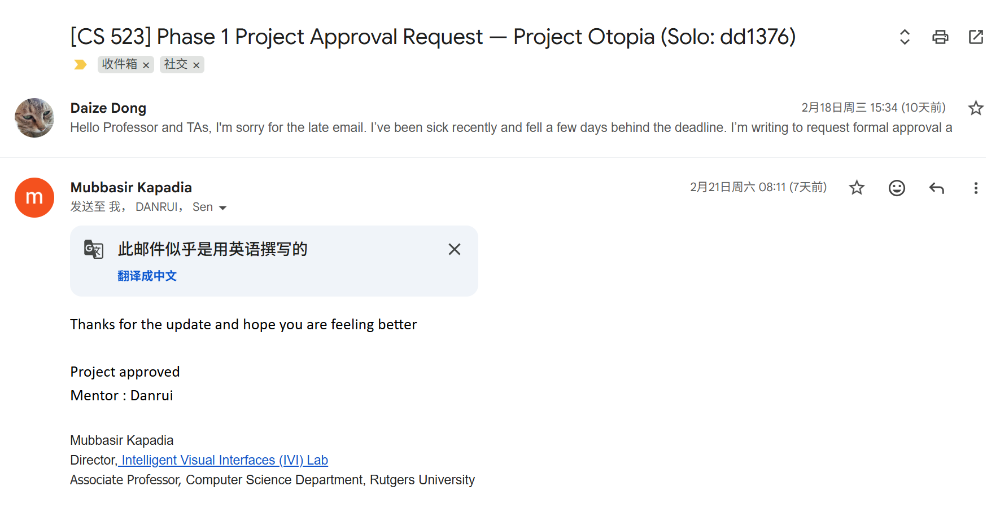

# Project Utopia HW02

Daize Dong, NetID dd1376

## Proof of Approval

## PRD

### Problem & Opportunity

Project Utopia targets a common weakness in simulation demos: many systems run, but users cannot clearly understand how decisions and motion emerge. We build a real-time interactive crowd simulation where users change roads, obstacles, and buildings, then immediately observe traffic flow and resource logistics shifts. Moreover, we introduce AI agents for decision making, providing motivation and intent feedback to game developers.

### Target Audience

Simulation game lovers, as well as game developers who want interpretable system behavior with AI.

### User Stories

1. As a user, I want to observe how AI agents make decisions under different NPC situations so that I can understand behavior changes across contexts.
2. As a user, I want to edit the map (roads, walls, and resource buildings) so that I can change NPC behavior and traffic flow patterns.
3. As a user, I want to observe NPC rerouting after map updates so that I can verify they adapt to new environments.
4. As a user, I want to observe how different NPC types (workers, visitors, and animals) move and interact so that I can compare their behavior models.
5. As a developer, I want to increase NPC count through stress testing so that I can evaluate performance and runtime stability.
6. As a developer, I want structured AI feedback outputs so that I can adjust NPC behavior and inspect detailed AI decision text.
7. As a developer, I want to inspect how A* pathfinding and Boids local avoidance work together so that I can verify dynamic reroute behavior after map edits.

### MoSCoW

#### Must Have

- AI API integration
- Basic NPC behavior tree (resource gathering, transportation, construction)
- Basic map editing (roads, walls,resource buildings)
- Global path planning based on A*
- Local avoidance and flocking behavior based on Boids

#### Should Have

- Selected-entity inspector with behavior state, role, and path progress
- Runtime performance HUD (FPS, frame time, total entities, warnings)
- Dynamic reroute visualization after map edits
- Runtime AI mode toggle with deterministic fallback when API is unavailable
- Basic event pressure that affects simulation

#### Could Have

- Scenario presets for repeatable benchmark maps
- Richer NPC interaction variety (expanded visitor and animal behaviors)

#### Won't Have (Out of Scope This Semester)

- High-fidelity art pipeline and custom cinematic asset production
- Complete progression loop
- Multiplayer

## Technical Specification

### Tech Stack

- Framework: Three.js + Vite
- Language: JavaScript
- External Libraries: NA

### AI Integration Strategy

Development Workflow (Offline):

- Coding Assistance: Using Codex/Copilot for modular refactors, test generation, and parameter tuning.
- Regression Testing: Offline deliverables include navigation refactors and dynamic reroute regression tests.

Runtime Integration (Online):

- LLM Director: Environment decisions requested via `/api/ai/environment` for high-level world behavior.
- NPC Policy: Group policy decisions requested via `/api/ai/policy` for role and intent selection.
- Validation: All LLM responses pass schema validation and guardrails before applying to world state.
- Fallback: Deterministic fallback keeps simulation running when AI is disabled, unavailable, or returns invalid output.

### Performance Constraints

- Target platform: Web browser.
- Target performance: maintain about 60 FPS at roughly 200 total entities with debug UI enabled.

## MVP Definition

The hardest technical challenge is integrating an LLM-based AI agent that issues meaningful, schema-validated decisions for NPC roles and environment policy in real time, with a deterministic fallback when the API is unavailable. The mid-term demo proves this works by showing AI-driven NPCs visibly change behavior in response to a live LLM decision, with the fallback mode keeping the simulation stable when the API is disabled. Everything else—multiple NPC role types, map editing polish, performance HUD, and scenario presets—is cut to keep the AI integration solid; A* pathfinding and Boids steering are supporting infrastructure, not the core risk.

## Interactive Mockup

https://github.com/DaizeDong/Project-Utopia
